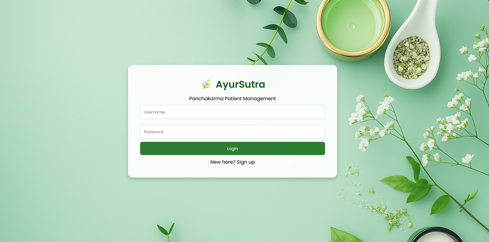
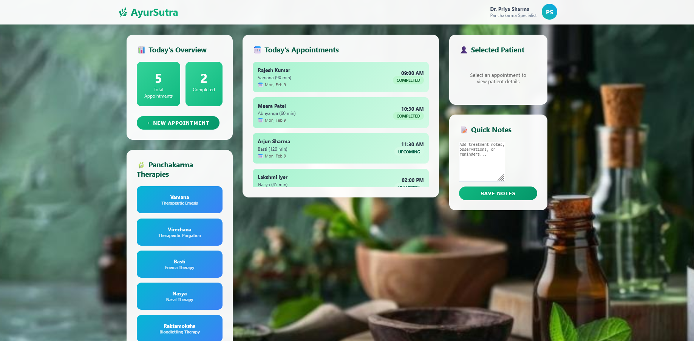
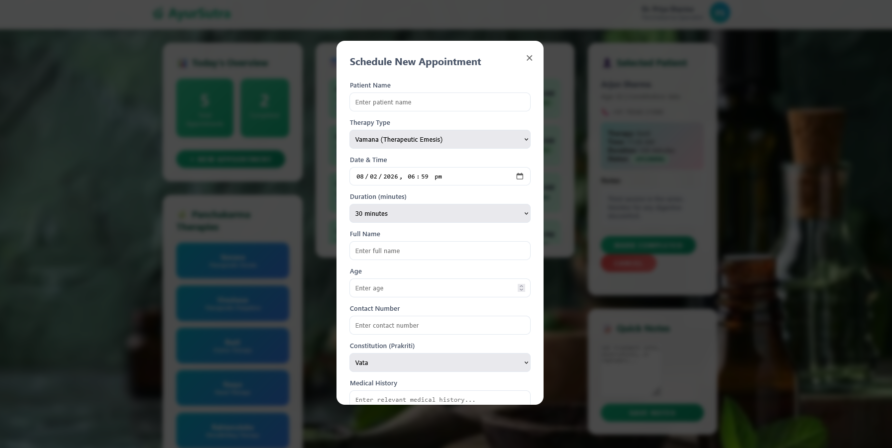

# AyurSutra – Ayurvedic Hospital Scheduler

A web-based frontend scheduling dashboard designed for Ayurvedic hospitals and Panchakarma clinics.

##  Features
- Schedule new patient appointments
- Conflict detection for overlapping time slots
- View upcoming & completed therapies
- Patient details panel
- Panchakarma therapy categorization
- Dynamic dashboard stats

##  Tech Stack
- HTML5
- CSS3
- JavaScript

## Project screenshots

### login page
.

### Dashboard View
.

### Patient details
.

